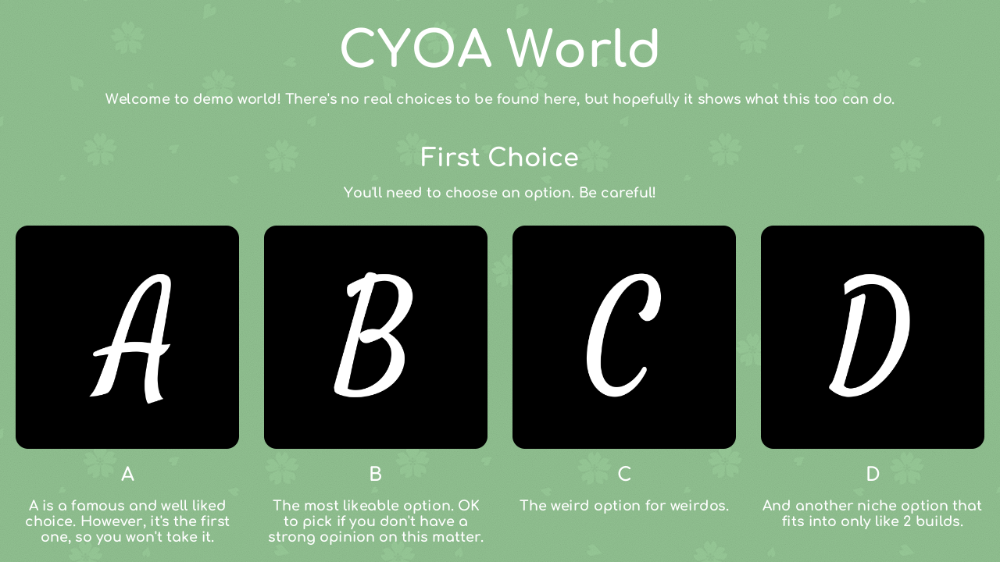
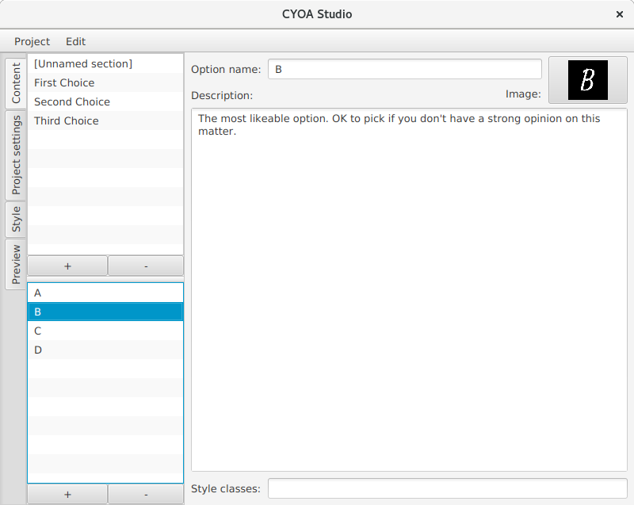
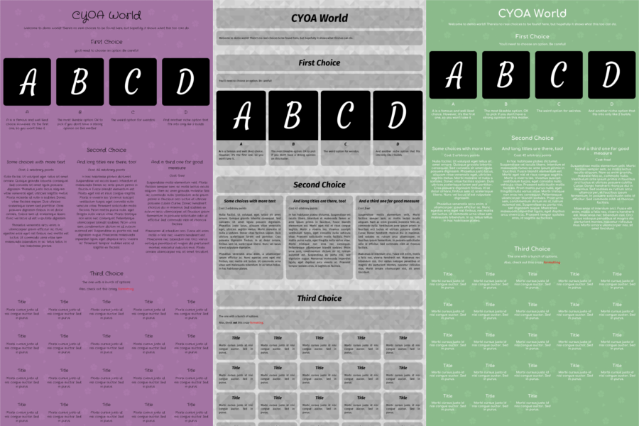

# CYOA Studio

CYOA Studio is a tool for creating simple CYOAs.
A CYOA is a game in which the player chooses a bunch of options from a given list, usually involving a currency system.

CYOA Studio doesn't offer the full possibilities of the image editing programs that are usually used for CYOA creation, but takes a lot of work of the creators hands.

## Features

* **Automatic layouting:** You only have to enter the content of your CYOA, CYOA Studio takes care of all the layouting.
* **Templating:** You can change the look of your CYOA at any time with a few clicks.
* **Customizability:** Through font, image and color costumization even CYOAs using the same templates can look unique.

## Downloads
