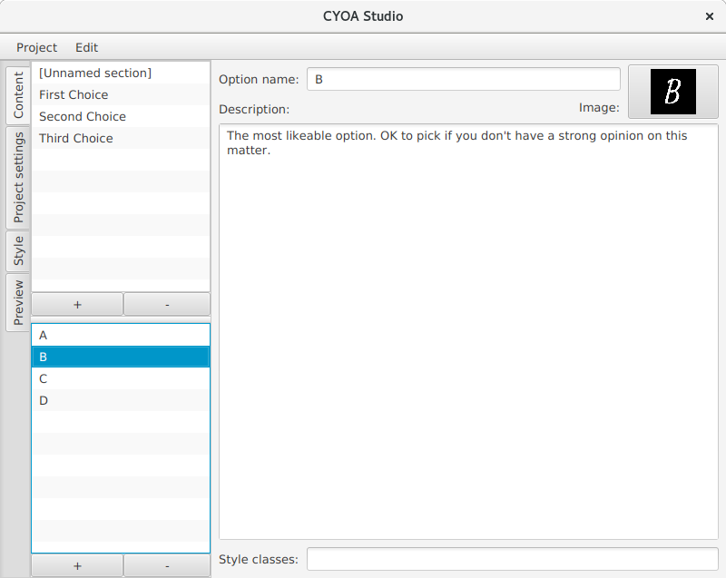
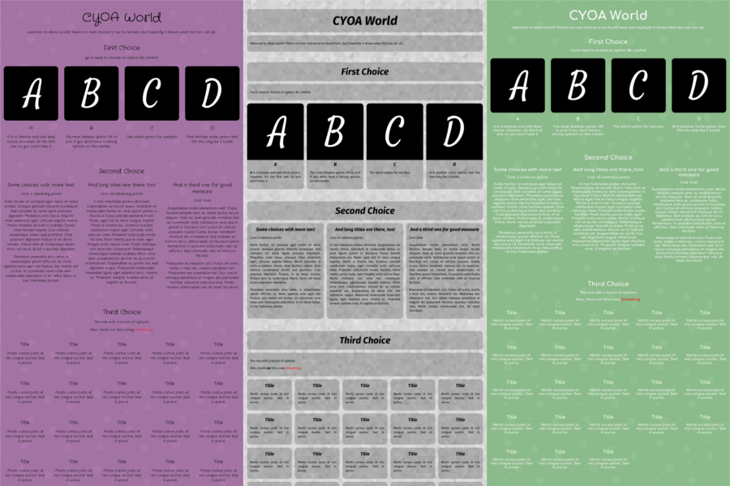

# CYOA Studio

CYOA Studio is a tool for creating simple CYOAs.
A CYOA is a game in which the player chooses a bunch of options from a given list, usually involving a currency system.

CYOA Studio doesn't offer the full possibilities of the image editing programs that are usually used for CYOA creation, but takes a lot of work of the creators hands.

## Features

* **Layouting:** You only have to enter the content of your CYOA; Get the layout and page splitting for free.
* **Templating:** You can change the look of your CYOA at any time with a few clicks.
* **Customizability:** Through font, image and color customization even CYOAs using the same templates can look unique.
* **Image handling:** You can drag that perfect image straight from your browser and crop it.

## Get it

You need at least [Java 8](https://java.com/en/) to run this program. As long as you have that installed, head over to the [releases page](https://github.com/Quantencomputer/cyoastudio/releases) and download the latest version.

There is a short [manual](manual.md) available.

## Templates

Here are two templates you can use so your project doesn't look so bland. Note that they might use fonts you don't have.

* [Quantum](templates/quantum.cyoatemplate)
* [Playful](templates/playful.cyoatemplate)

For template creation, check out the [template creation guide](template_makind.md).
