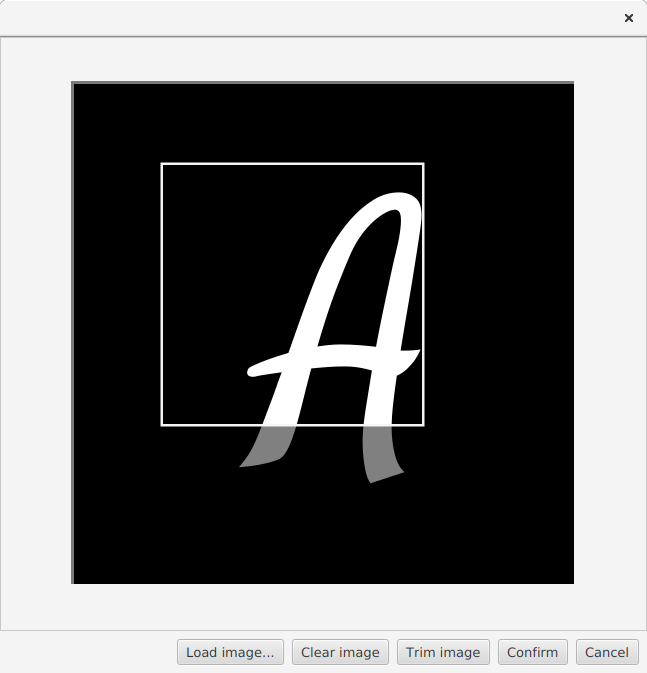
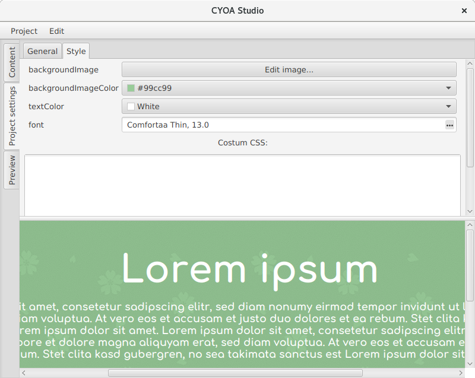

# CYOA Studio Manual

## Project structure

A CYOA is called a project. Each project consists of sections, each of which can have a title, a description and any number of options.
The options each also have a title and a description, and can also contain an image.

In order to be displayed, and finally exported to an image, the project also uses a template.
The default template is quite bland, but you can import another theme at any time to change the appearance of your CYOA without affecting the content you have already entered.

## Editing a project

Upon starting the program, you will be greeted by the main editing tab.

Using the `Project` menu at the top, you can start a new project, open one or save your currently opened project.
You'll also find several options for project import/export and changing the template.

On the left, you can swtich between three categories:

- The `Content` tab allows you to edit your sections and options.
- The `Project settings` tab allows you to edit general options for your project (including the title)
- The `Style` tab allows you to costumize the template your project is using.
- The `Preview` tab allows you to view your project in the form it would look like if exported right now.

### Content

On the left, there are two lists.
The upper one contains the sections of your project, the lower one contains the options of the currently selected sections.

Upon selecting a section, the area to the right allows you to edit its values:

- `Section name` is the name of the section, as displayed in the editor and used as its title when exporting.
- `Image positioning` determines how the images of the options are layed out.
- `Options per row` determines how many options are put into a row.
- `Image aspect ratio` allows you to specify an aspect ratio that all the options in this section should use. This aspect ratio is enforced when trimming images.
- `Description` is the description as displayed in the document.
- `Style classes` allows you to set costum CSS classes for costum styling (for advanced use cases).

Additionally, selecting a section displays its options in the lower list. Upon selecting an option, the area to the right allows you to edit its values:

- `Option name` is the name of the option, as displayed in the editor and used as its title when exporting.
- `Image` displays a thumbnail of the image the option uses. Clicking the button allows you to edit the image.
- `Description` is the description as displayed in the document.
- `Style classes` allows you to set costum CSS classes for costum styling (for advanced use cases).

You can create new sections and options using the corresponding `+` buttons. You can delete selected entries by using the `-` button.
Using the context menu, you can also duplicate entries. You can also access these actions using the `Edit` menu on top, which also allows you to sort entries alphabetically.

The descriptions as well as the names are parsed as common markdown. This means you can use `*italic text*`, `**bold text**`, lists and arbitrary HTML for formatting.

#### Image editor

The image editor allows you to load and trim images. You can load images by using the `Load image` button, or by dropping images directly into the window. You can use drag and drop to quickly load images from your file system or even directly from your browser.

You can select an area of the image and cut it down using the `Trim` button. If the section has a fixed aspect ratio, it will automatically be enforced here.

### Project settings

This tab allows you to edit basic options of the project.

- `Project title` is the title as displayed on top of the document.
- `Maximum image height` determines how many pixels tall exported images may be at most. Large values may create very large image files. Very large values will result in errors on export.

### Style

A template may give you several costumization options, such as changing the background color or font. The exact options are dependent on the template used. 

Notes:

- When clicking on `Costum color` in the color editor, the color selector may appear behind the main window. In that case, drag the main window around to find it.
- For now, only the font family is used when selecting a font.

In the `Costum CSS` field you can enter additional CSS code to format the document. This might prove useful in combination with the costum classes on sections and options.

### Preview

Displays a preview of your CYOA.

## Export

### Image

When you are content with your content, you can export your project to images using the `Project->Export as->Image...` option. You will be prompted for a folder. When you have selected a folder, the export process starts, creating images with your project name, a page number and the `.png` file ending in that folder. This process may take a while.

## Templates

You can change the look of your document by importing a template using the `Project->Import template` options. You'll most likely want to import a `.cyoatemplate` file using the `From file...` option. Importing a template will reset all your costum style options to the template's default options. Costum classes and costum CSS will be kept however.